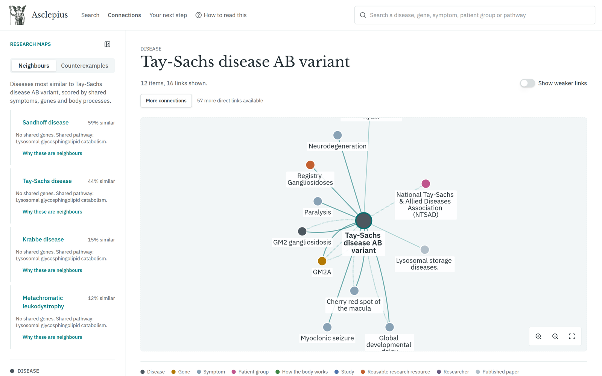
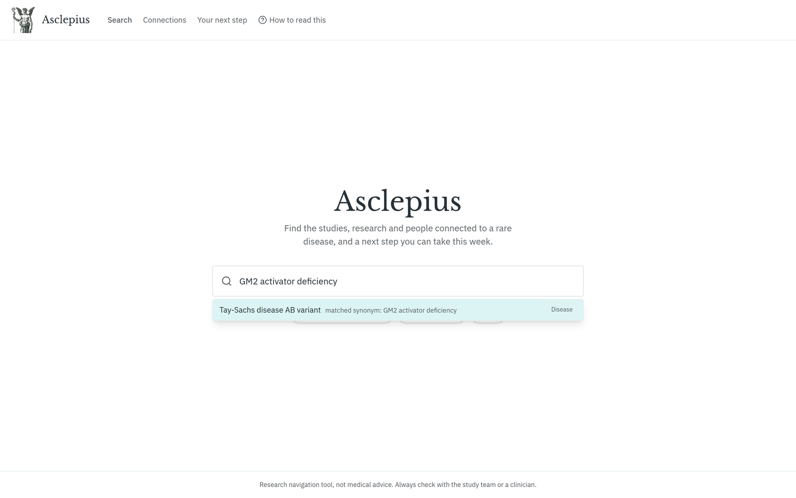
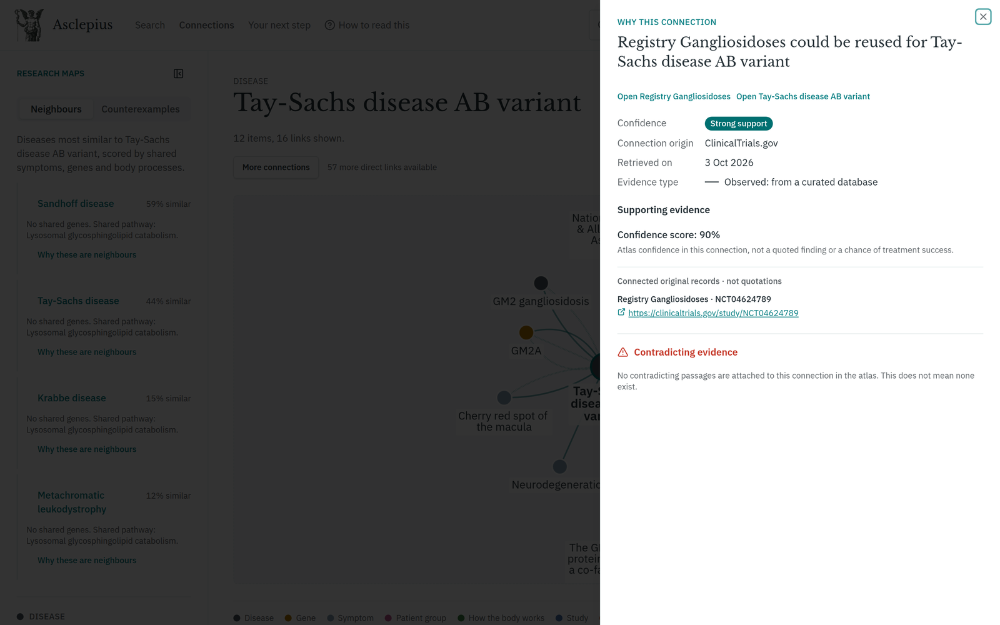
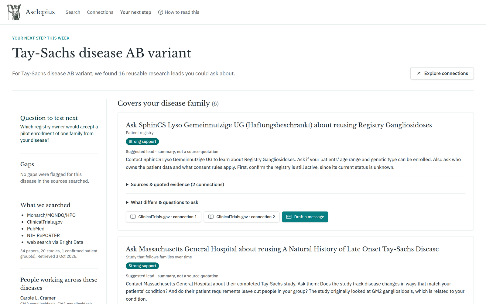
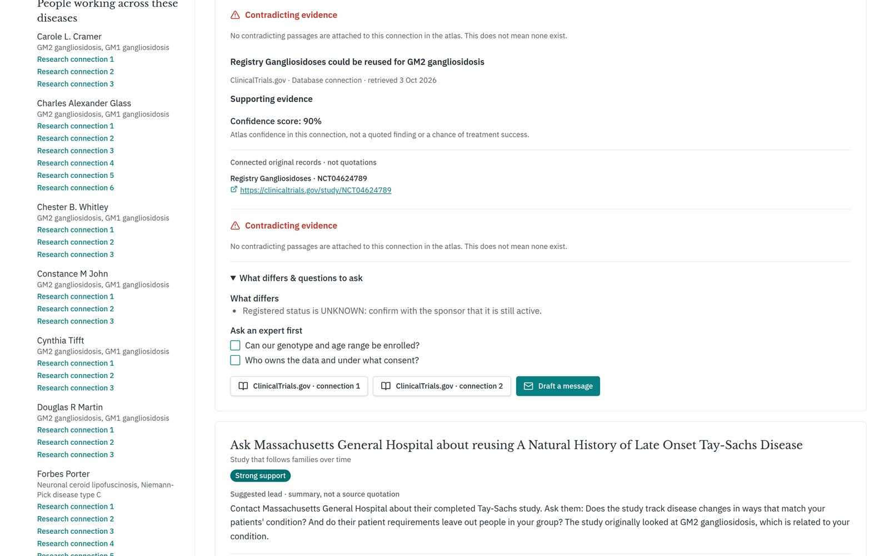
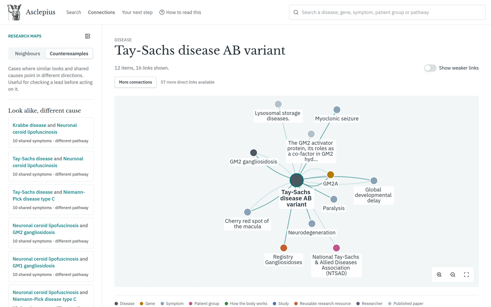
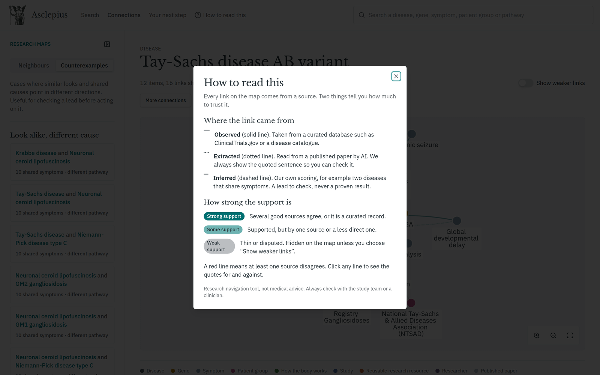
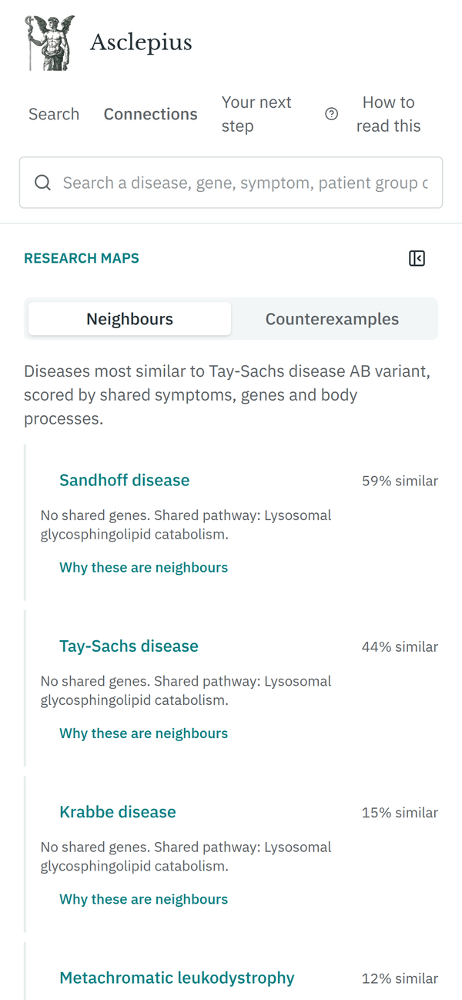
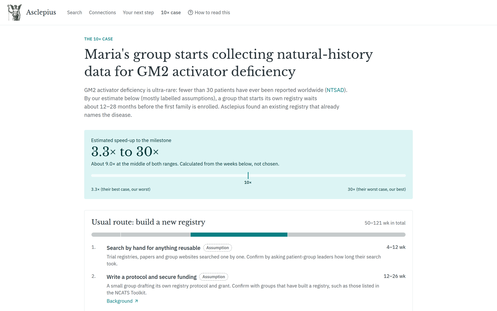
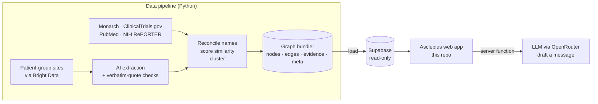

<div align="center">


# Asclepius

**An AI atlas for the world's rare diseases.**
Find the studies, research and people connected to a rare disease, and a next step you can take this week, with a source for every claim.

[**Live demo → asclepius.avinash.social**](https://asclepius.avinash.social/)

Built for the **Hack-Nation × OpenAI × Buffalo Initiative** challenge "AI Atlas for the World's Rare Diseases".




</div>

---

## The problem

About 300 million people live with a rare disease, and most of those diseases have no approved treatment. For the rarest ones, there is often no registry, no research group and no obvious place to start. The data that could help is real, but it is scattered across disease catalogues, study registries, papers, grant databases and patient-group websites.

## Meet Maria

Maria leads a patient group for **GM2 activator deficiency**, one of the rarest lysosomal diseases. She is not a scientist. She needs to know:

1. Which diseases are most like hers?
2. Is there a registry or study she could **reuse** instead of starting from zero?
3. Who runs it, and **what should she ask them this week**?
4. How much should she **trust** each answer?

Asclepius answers those four questions on one screen, and shows the evidence behind every line.

## Walkthrough

### 1. One search box, any name

Type a disease, gene, symptom, patient group or pathway. Synonyms resolve to the same node, so *"GM2 activator deficiency"* finds **Tay-Sachs disease AB variant**, its ontology name.



### 2. A readable map of connections

The disease sits at the centre, with its genes, symptoms, studies, reusable registries and patient groups around it. The map opens with about 12 items and reveals more on request, and it never shows more than 60. The left rail ranks the **closest neighbouring diseases**, scored by shared symptoms weighted by how specific each symptom is.


### 3. Every connection explains itself

Click any line to see where it came from: the source, the retrieval date, how strong the support is, and whether it was observed in a database, extracted from a paper (with the verbatim quote) or inferred by our scoring. Contradicting evidence is shown, never hidden.



### 4. Your next step this week

A ranked list of leads Maria can act on, such as a registry that already covers her disease family. Each lead says what differs from her disease, what to ask an expert first, and links to the original records. The registry's status is listed as *unknown*, so the app tells her to confirm it is still active. **Draft a message** writes a short first email to the study team, citing only facts from the atlas.



<details>
<summary><b>Expanded lead: sources, what differs, questions to ask</b></summary>
<br />

</details>

### 5. Honest about what looks alike but isn't

The **Counterexamples** tab shows disease pairs that share many symptoms but have a different cause, or share a pathway but look different. These are the cases to check before acting on a lead.



### 6. Built for non-scientists

A plain-language **How to read this** guide explains line styles and support levels. The layout works on a phone.

<p>

&nbsp;

</p>

### 7. The 10× case

One milestone: Maria's group starts collecting natural-history data. The page compares building a new registry with joining Registry Gangliosidoses, which already names her disease. Every step is a published figure, a connection in the atlas, or a labelled assumption. The speed-up is calculated from those weeks (3.3× to 30×, about 9× at the middle), and the page lists what to validate next.



## How we keep it trustworthy

| Rule | What it means |
|---|---|
| **No source, no line** | Every connection carries its source and retrieval date. The data pipeline refuses to write one without them. |
| **Quotes are checked** | A relationship read from a paper by AI is kept only if its quote appears word for word in the abstract and both entities resolve to known nodes. In the current build, 281 of 570 claims passed. |
| **Human evidence only** | Findings reported only in animals are dropped. |
| **Contradictions stay visible** | Evidence against a connection is stored beside it and lowers its support level. |
| **Similar looks ≠ same cause** | Symptom similarity and shared mechanism are scored separately, and counterexamples are shown on purpose. |
| **Gaps are stated** | When no supported route exists, the app says so and lists the sources it searched. |
| **AI text is validated** | Drafted messages are rejected unless every cited connection belongs to that lead and every clinical term in them appears in the stored facts. For a lead with no stored difference, a draft that claims one is also rejected. A draft with unsupported terms gets one retry; a draft still rejected is replaced by a message built only from the stored step data. |
| **Not medical advice** | The app never promises a treatment, and every page says so. |

## What's in the atlas

- **Nine related lysosomal and leukodystrophy diseases:** Tay-Sachs disease AB variant (GM2 activator deficiency), Tay-Sachs, Sandhoff, GM2 and GM1 gangliosidosis, Krabbe, metachromatic leukodystrophy, Niemann-Pick type C and neuronal ceroid lipofuscinosis.
- **1,461 nodes:** symptoms, researchers, reusable registries and studies, papers, genes, patient groups and curated pathways.
- **2,372 connections:** 2,071 observed, 142 extracted from text with quotes, and 159 inferred.
- **Sources:** Monarch (MONDO and HPO), ClinicalTrials.gov, PubMed, NIH RePORTER, and patient-group websites fetched through Bright Data.

## Built with OpenAI

| Brief | How Asclepius does it | Model |
|---|---|---|
| **Extract** | Reads PubMed abstracts and patient-group pages into claims and groups; each kept only if its quote is verbatim in the source | `openai/gpt-4.1-mini` via OpenRouter |
| **Reconcile** | Resolves names the model reads (for example "GM2 activator protein deficiency") to one stable MONDO, HGNC or HPO node | `openai/gpt-4.1-mini` via OpenRouter |
| **Explain** | Writes plain-language next steps and the "Draft a message" email, citing only connections attached to that step; drafts with clinical claims, or differences, not backed by the atlas are rejected | `openai/gpt-4.1-mini` (pipeline), `openai/gpt-oss-120b` (site) |

## Architecture



This repository is the **web app**. It reads the graph from Supabase with the publishable key and never writes to it. A separate Python pipeline builds the graph and loads it.

| Layer | Tech |
|---|---|
| App framework | TanStack Start (React 19, TypeScript, Vite) |
| UI | Tailwind CSS 4, shadcn/ui (Radix) |
| Graph | Cytoscape.js with a label-aware layout |
| Data | Supabase (Postgres, public read-only access) |
| AI drafting | TanStack server functions calling OpenRouter (openai/gpt-oss-120b), with a clinical-claim guard and template fallback |

## Run it locally

You need [Bun](https://bun.sh) (or Node.js 22 or newer).

```sh
git clone https://github.com/droidmaximus/asclepius.git
cd asclepius
bun install
bun run dev
```

The repo includes a `.env` with the Supabase URL and the **publishable** key, which is read-only by design. To enable **Draft a message**, set `OPENROUTER_API_KEY` (and optionally `OPENROUTER_MODEL`) on the server.

```sh
bun run test    # vitest
bun run build   # production build
```

See [docs/demo-script.md](docs/demo-script.md) for the 1-minute walkthrough.

## Roadmap

- Extend the pipeline beyond the first cluster of nine diseases.
- Add more registries and natural-history study sources.
- Let patient groups confirm or correct their own entries.

---

<div align="center">
<sub>Research navigation tool, not medical advice. Always check with the study team or a clinician.</sub>
</div>
